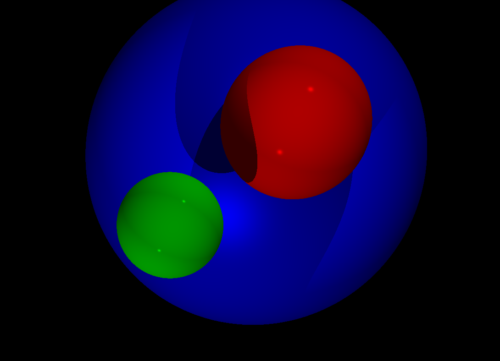
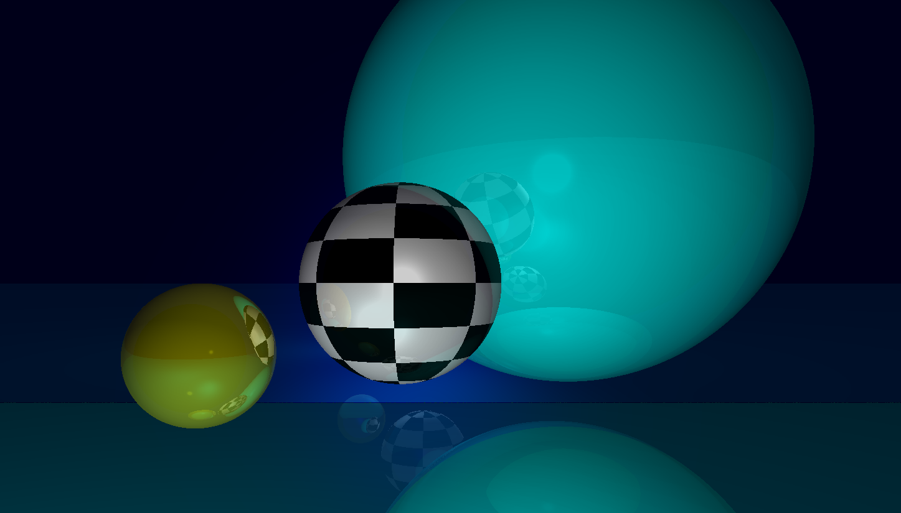
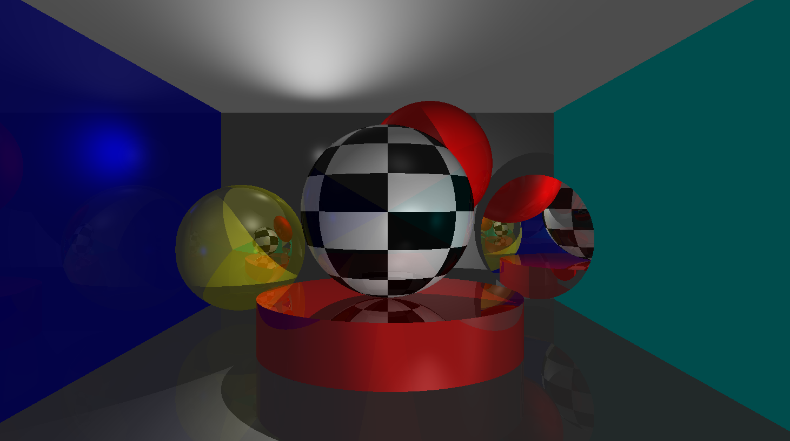

# miniRT



**miniRT** is a simple yet powerful ray tracing engine designed for rendering 3D scenes with realistic lighting, shadows, and reflections. It is built as part of the common core of 42 London.

## Table of Contents

- [Features](#features)
- [Installation](#installation)
- [Usage](#usage)
- [Scene Description File](#scene-description-file)
- [Define Scene with Codes](#define-scene-with-codes)


## Features



- **Basic Primitives**: Supports spheres, planes, and cylinders.
- **Lighting**: Includes ambient, directional, and point lights.
- **Shadows**.
- **Reflections**: Supports reflective surfaces.
- **Configurable Camera**: Customizable camera position and orientation.
- **Color**: RGB colors and customizable checkerboard color for spheres.

## Installation

Ubuntu and X window are required. To install **miniRT**, :

1. **Clone the repository:**
    ```bash
    git clone https://github.com/theVeryPulse/miniRT.git
    ```

2. **Navigate to the project directory:**
    ```bash
    cd miniRT
    ```

3. **Build the project:**
    ```bash
    make
    ```

## Usage

Once compiled, you can use the `miniRT` executable to render 3D scenes.

**Basic Command**

```bash
./miniRT [scene_file.rt]
```
- `scene_file.rt`: Path to the scene description file (in .rt format).


**Example**
```bash
./miniRT demo/room.rt
```

## Scene Description File
The scene file is a text file that describes the 3D scene to be rendered. Here's a simple example:

```plaintext
A  0.3                                       255,255,255
C  0,0,0            0,0,1    70
L  -10,1,-10                 0.9             255,255,255
sp 0,0,-20                   4               255,0,0
pl 0,-10,0          0,1,0                    0,100,100
cy 5.0,0.0,-20.6    1,0,0    10.2    2.42    10,0,255
```
- `A`: Ambient light (intensity, color) 
- `C`: Camera (position, angle, field of view)
- `L`: Point light (position, intensity, color)
- `sp`: Sphere (position, radius, color)
- `pl`: Plane (position, normal vector, color)
- `cy`: Cylinder (position of center, axis, diameter, height, color)

Coordinate convention: right-hand coordinates: x-axis points to the right of screen, y-axis points to the up of screen, z-axis points outwards the screen.

Camera angle vector: points to the viewer rather than the scene. 

Multiple point lights are supported. In order to define multiple point lights, use `l` instead of `L`.
Example
```plaintext
A  0.3                                       255,255,255
C  0,0,0            0,0,1    70
l  -10,1,-10                 0.9             255,255,255
l  0,-10.5                   0.3             255,255,255
sp 0,0,-20                   4               255,0,0
pl 0,-10,0          0,1,0                    0,100,100
cy 5.0,0.0,-20.6    1,0,0    10.2    2.42    10,0,255
```

*Note: Colored lights are NOT supported but parameters are required as part of the format.*


## Define Scene with Codes

More options on reflectivity, specular exponent, checkerboard colored sphere are supported only by editing the code directly. Check `load_scene_from_code.c` for example.


